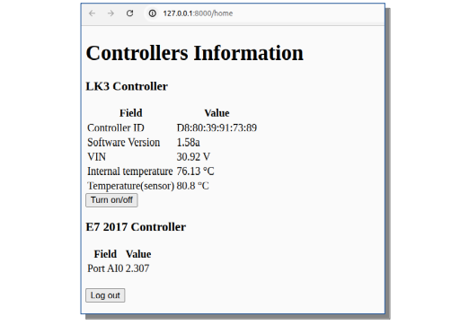

realtime
========
A real-time acquisition system from IoT devices.



## Getting started

### Set up the enviroment
```bash
python3 -m venv env
source env/bin/activate
```

### Install the necessary libraries
```bash
pip install pyyaml flask pyModbusTCP gunicorn requests
```

### Start the app
```bash
python3 app.py
```

### How to use the app


#### User Authentication(using sqlite library)
- **Signup**: Users can create an account using their username, email, phone number, and password.
- **Login**: Users can log in using their username and password.
- **Logout**: Users can log out to end their session.

> Dummy credentials are:
- `username`:jsmith
- `password`:12345
#### Monitoring and Control
- **Real-time Data**: The application fetches and displays real-time data from connected controllers.
- **Toggle Control**: Users can toggle the state of the device (turn on/off).

#### Routes

- `/` (GET): Landing page. Redirects to the home page if authenticated.
- `/signup` (GET/POST): Signup page for creating a new account.
- `/login` (GET/POST): Login page for existing users.
- `/runtime` (GET): Endpoint to fetch real-time data from the LK3 controller.
- `/runtime_E7` (GET): Endpoint to fetch real-time data from the ET-7017 device.
- `/home` (GET): Home page displaying controller data and control options.
- `/toggle` (POST): Endpoint to toggle the device state.
- `/logout` (POST): Endpoint to log out the user.


### Notes
- Ensure the Modbus server and the LK3/ET-7017 controllers are accessible from the network where the Flask application is running(you can change the ip address and port for both controllers,with the information of your devices in the global variables section).
    > Otherwise(If the two controllers are not accessible , the app is designed in use with this two simulators)
    - [LK3 simulator](https://github.com/CerneaMihnea/lk3-simulator)
    - [ET-7017 simulator](https://github.com/CerneaMihnea/et-7017-simulator)

- Adjust sleep intervals in the data fetching threads as per your requirement for real-time updates and system performance balance.


### Future Enhancements
- Implement robust error handling and logging.
- Add email verification and password recovery features.
- Secure password storage using hashing (e.g., sha256, bcrypt).
- Expand device support and provide a more flexible configuration.
- Improve the user interface for better user experience.
